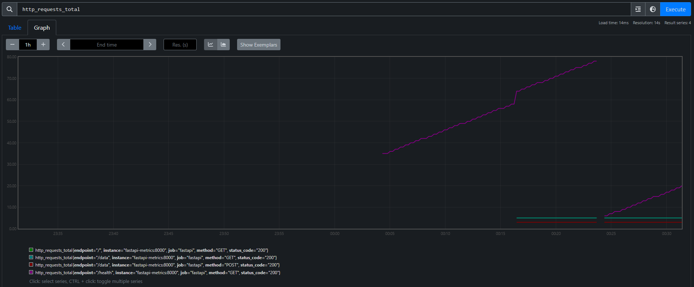
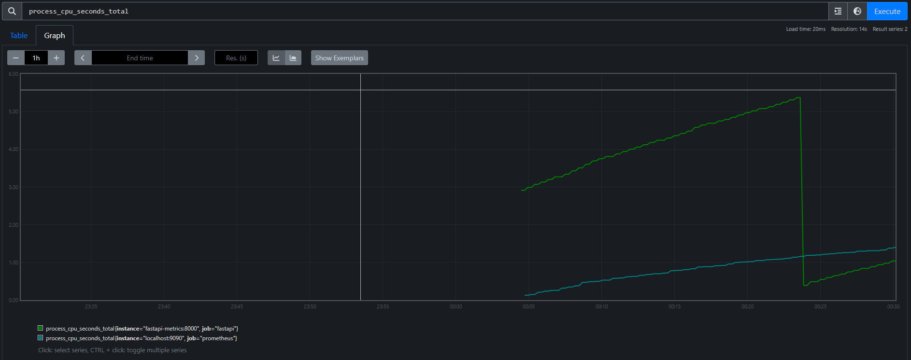
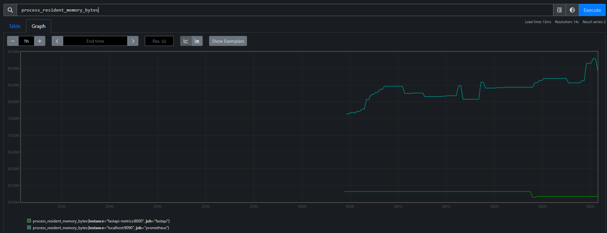

# FastAPI Metrics Monitoring System

A comprehensive FastAPI application that implements both system-level and application-level metrics monitoring using Prometheus metrics format.

## Features

- **System Metrics**: CPU usage, memory consumption, process statistics
- **HTTP Metrics**: Request volume, performance, latency tracking
- **Real-time Monitoring**: Live metrics collection and exposition
- **Production Ready**: Proper error handling and configuration management
- **Prometheus Compatible**: Standard metrics format for easy integration

## Quick Start

### Installation

1. Clone the repository:
```bash
git clone <repository-url>
cd MonitoringSystem
```

2. Create a virtual environment:
```bash
python -m venv .venv
source .venv/bin/activate  # On Windows: .venv\Scripts\activate
```

3. Install dependencies:
```bash
pip install -r requirements.txt
```

### Running the Application

```bash
# Development mode
python -m app.main

# Production mode with Uvicorn
uvicorn app.main:app --host 0.0.0.0 --port 8000
```

The application will be available at `http://localhost:8000`

## API Endpoints

### Core Endpoints

- `GET /`: Root endpoint with basic information
- `GET /health`: Comprehensive health check with system information  
- `GET /health/ready`: Readiness check for orchestration
- `GET /health/live`: Liveness check for orchestration
- `GET /metrics`: Prometheus metrics exposition endpoint

### Data Endpoints

- `POST /data`: Create/store data items
- `GET /data`: Retrieve all stored data
- `GET /data/{key}`: Retrieve specific data by key
- `DELETE /data/{key}`: Delete data by key

## Available Metrics

Your FastAPI Metrics Monitoring System exposes the following metrics endpoints and data:

### Live Metrics Examples

The following screenshots show real metrics data from a running FastAPI application:

#### HTTP Request Metrics

*HTTP requests tracked by endpoint, method, and status code showing request volume over time*

#### System Performance Metrics

*CPU usage metrics showing both FastAPI application and Prometheus server resource consumption*


*Memory consumption tracking for both FastAPI application and Prometheus server*

#### Response Time Metrics
))%20by%20(le)).png)
*HTTP request duration histogram showing response time distribution (95th percentile calculation)*

### System Metrics

| Metric Name | Type | Description | Example Query |
|-------------|------|-------------|---------------|
| `process_cpu_seconds_total` | Counter | Total CPU time consumed by the process | `rate(process_cpu_seconds_total[5m])` |
| `process_resident_memory_bytes` | Gauge | Physical memory currently used | `process_resident_memory_bytes / 1024 / 1024` |
| `process_virtual_memory_bytes` | Gauge | Virtual memory allocated | `process_virtual_memory_bytes / 1024 / 1024` |
| `process_start_time_seconds` | Gauge | Process start time since Unix epoch | `process_start_time_seconds` |
| `process_open_fds` | Gauge | Number of open file descriptors | `process_open_fds` |
| `fastapi_uptime_seconds` | Gauge | Process uptime in seconds | `fastapi_uptime_seconds / 3600` |
| `fastapi_thread_count` | Gauge | Number of OS threads | `fastapi_thread_count` |
| `fastapi_cpu_usage_percent` | Gauge | CPU usage percentage | `fastapi_cpu_usage_percent` |
| `python_gc_collections_total` | Counter | Garbage collection statistics | `rate(python_gc_collections_total[5m])` |

### HTTP Application Metrics

| Metric Name | Type | Description | Labels | Example Query |
|-------------|------|-------------|--------|---------------|
| `http_requests_total` | Counter | Total HTTP requests | method, endpoint, status_code | `rate(http_requests_total[5m])` |
| `http_request_duration_seconds` | Histogram | Request duration distribution | method, endpoint | `histogram_quantile(0.95, sum(rate(http_request_duration_seconds_bucket[5m])) by (le))` |
| `http_request_size_bytes` | Histogram | Request size distribution | method, endpoint | `rate(http_request_size_bytes_sum[5m])` |
| `http_response_size_bytes` | Histogram | Response size distribution | method, endpoint, status_code | `rate(http_response_size_bytes_sum[5m])` |
| `http_requests_active` | Gauge | Number of active requests | method, endpoint | `sum(http_requests_active)` |

### Application Information

| Metric Name | Type | Description | Information |
|-------------|------|-------------|-------------|
| `fastapi_app_info` | Info | Application metadata | version, name, python_version |
| `fastapi_process_info` | Info | Process information | pid, started, cwd, exe |

## Key Performance Indicators (KPIs)

### Request Volume & Performance
```promql
# Requests per second (global)
sum(rate(http_requests_total[5m]))

# Requests per second by endpoint
sum(rate(http_requests_total[5m])) by (endpoint, method)

# Error rate percentage
sum(rate(http_requests_total{status_code=~"5.."}[5m])) / sum(rate(http_requests_total[5m])) * 100

# Response time percentiles
histogram_quantile(0.50, sum(rate(http_request_duration_seconds_bucket[5m])) by (le))  # 50th percentile
histogram_quantile(0.95, sum(rate(http_request_duration_seconds_bucket[5m])) by (le))  # 95th percentile
histogram_quantile(0.99, sum(rate(http_request_duration_seconds_bucket[5m])) by (le))  # 99th percentile
```

### System Resource Utilization
```promql
# CPU usage rate (percentage)
rate(process_cpu_seconds_total[5m]) * 100

# Memory usage in MB
process_resident_memory_bytes / 1024 / 1024

# Memory usage percentage (if you know total system memory)
process_resident_memory_bytes / (8 * 1024 * 1024 * 1024) * 100  # Assuming 8GB total

# Application uptime in hours
fastapi_uptime_seconds / 3600

# Thread utilization
fastapi_thread_count
```

### Business Metrics
```promql
# Request success rate
sum(rate(http_requests_total{status_code!~"5.."}[5m])) / sum(rate(http_requests_total[5m])) * 100

# Average request size
rate(http_request_size_bytes_sum[5m]) / rate(http_request_size_bytes_count[5m])

# Average response size
rate(http_response_size_bytes_sum[5m]) / rate(http_response_size_bytes_count[5m])

# Requests by status code
sum(rate(http_requests_total[5m])) by (status_code)
```

## Alerting Rules Examples

### Critical Alerts
```yaml
# High error rate
alert: HighErrorRate
expr: sum(rate(http_requests_total{status_code=~"5.."}[5m])) / sum(rate(http_requests_total[5m])) > 0.05
for: 2m
labels:
  severity: critical
annotations:
  summary: "Error rate above 5%"

# Application down
alert: ApplicationDown
expr: up{job="fastapi-metrics"} == 0
for: 30s
labels:
  severity: critical
annotations:
  summary: "FastAPI application is down"
```

### Warning Alerts
```yaml
# High response time
alert: HighResponseTime
expr: histogram_quantile(0.95, sum(rate(http_request_duration_seconds_bucket[5m])) by (le)) > 1
for: 5m
labels:
  severity: warning
annotations:
  summary: "95th percentile response time above 1 second"

# High memory usage
alert: HighMemoryUsage
expr: process_resident_memory_bytes / 1024 / 1024 > 512
for: 3m
labels:
  severity: warning
annotations:
  summary: "Memory usage above 512MB"

# High CPU usage
alert: HighCPUUsage
expr: rate(process_cpu_seconds_total[5m]) > 0.8
for: 3m
labels:
  severity: warning
annotations:
  summary: "CPU usage above 80%"
```

## Grafana Dashboard Queries

### Primary Dashboard Panels

**Request Rate Panel:**
```promql
sum(rate(http_requests_total[5m])) by (method, endpoint)
```

**Error Rate Panel:**
```promql
sum(rate(http_requests_total{status_code=~"5.."}[5m])) / sum(rate(http_requests_total[5m])) * 100
```

**Response Time Panel:**
```promql
histogram_quantile(0.95, sum(rate(http_request_duration_seconds_bucket[5m])) by (le))
histogram_quantile(0.50, sum(rate(http_request_duration_seconds_bucket[5m])) by (le))
```

**Memory Usage Panel:**
```promql
process_resident_memory_bytes / 1024 / 1024
process_virtual_memory_bytes / 1024 / 1024
```

**CPU Usage Panel:**
```promql
rate(process_cpu_seconds_total[5m]) * 100
fastapi_cpu_usage_percent
```

## Metrics Collection Details

### Collection Intervals
- **HTTP Metrics**: Collected in real-time for every request
- **System Metrics**: Collected every 5 seconds (configurable via `METRICS_COLLECTION_INTERVAL`)
- **Prometheus Scraping**: Every 5 seconds (configured in prometheus.yml)

### Metric Cardinality
- **HTTP Request Labels**: Endpoint paths are normalized to prevent high cardinality
  - UUIDs replaced with `{uuid}`
  - Numeric IDs replaced with `{id}`
  - Query parameters removed
- **Status Code Labels**: Standard HTTP status codes (200, 404, 500, etc.)
- **Method Labels**: Standard HTTP methods (GET, POST, PUT, DELETE, etc.)

### Performance Impact
- **Overhead**: ~1-2ms per HTTP request for metrics collection
- **Memory**: Approximately 10-50MB additional memory usage depending on request volume
- **CPU**: <1% additional CPU usage for metrics collection

## Configuration

Environment variables for configuration:

| Variable | Default | Description |
|----------|---------|-------------|
| `HOST` | `0.0.0.0` | Server host |
| `PORT` | `8000` | Server port |
| `METRICS_COLLECTION_INTERVAL` | `5` | System metrics collection interval (seconds) |
| `ENABLE_SYSTEM_METRICS` | `true` | Enable system metrics collection |
| `APP_NAME` | `fastapi-metrics-app` | Application name |
| `APP_VERSION` | `1.0.0` | Application version |

## Docker Deployment

### Dockerfile

```dockerfile
FROM python:3.11-slim

WORKDIR /app

COPY requirements.txt .
RUN pip install --no-cache-dir -r requirements.txt

COPY app/ ./app/

EXPOSE 8000

CMD ["uvicorn", "app.main:app", "--host", "0.0.0.0", "--port", "8000"]
```

### Docker Compose

```yaml
version: '3.8'

services:
  fastapi-metrics:
    build: .
    ports:
      - "8000:8000"
    environment:
      - HOST=0.0.0.0
      - PORT=8000
      - METRICS_COLLECTION_INTERVAL=5
      - ENABLE_SYSTEM_METRICS=true
    healthcheck:
      test: ["CMD", "curl", "-f", "http://localhost:8000/health"]
      interval: 30s
      timeout: 10s
      retries: 3
      start_period: 40s

  prometheus:
    image: prom/prometheus:latest
    ports:
      - "9090:9090"
    volumes:
      - ./prometheus.yml:/etc/prometheus/prometheus.yml
    command:
      - '--config.file=/etc/prometheus/prometheus.yml'
      - '--storage.tsdb.path=/prometheus'
      - '--web.console.libraries=/etc/prometheus/console_libraries'
      - '--web.console.templates=/etc/prometheus/consoles'
      - '--web.enable-lifecycle'
```

### Prometheus Configuration

```yaml
# prometheus.yml
global:
  scrape_interval: 15s

scrape_configs:
  - job_name: 'fastapi-metrics'
    static_configs:
      - targets: ['fastapi-metrics:8000']
    metrics_path: '/metrics'
    scrape_interval: 5s
```

## Monitoring Setup

### Grafana Dashboard

Key metrics to monitor:

1. **Request Volume**: `rate(http_requests_total[5m])`
2. **Error Rate**: `rate(http_requests_total{status_code=~"5.."}[5m])`
3. **Response Time**: `histogram_quantile(0.95, sum(rate(http_request_duration_seconds_bucket[5m])) by (le))`
4. **CPU Usage**: `rate(process_cpu_seconds_total[5m])`
5. **Memory Usage**: `process_resident_memory_bytes`

### Alerting Rules

Example Prometheus alerting rules:

```yaml
groups:
  - name: fastapi-metrics
    rules:
      - alert: HighErrorRate
        expr: rate(http_requests_total{status_code=~"5.."}[5m]) > 0.1
        for: 2m
        labels:
          severity: warning
        annotations:
          summary: "High error rate detected"
          
      - alert: HighResponseTime
        expr: histogram_quantile(0.95, sum(rate(http_request_duration_seconds_bucket[5m])) by (le)) > 1
        for: 5m
        labels:
          severity: warning
        annotations:
          summary: "High response time detected"
```

## Development

### Project Structure

```
fastapi-metrics-app/
├── app/
│   ├── __init__.py
│   ├── main.py                 # FastAPI application entry point
│   ├── config.py              # Configuration management
│   ├── metrics/
│   │   ├── __init__.py
│   │   ├── system_metrics.py  # CPU, memory metrics
│   │   └── http_metrics.py    # HTTP request metrics
│   ├── middleware/
│   │   ├── __init__.py
│   │   └── metrics_middleware.py
│   └── routers/
│       ├── __init__.py
│       ├── api.py             # Business logic endpoints
│       └── health.py          # Health check endpoints
├── requirements.txt
└── README.md
```

### Testing

```bash
# Install test dependencies
pip install pytest pytest-asyncio httpx

# Run tests
pytest

# Load testing
curl -X POST http://localhost:8000/data \
  -H "Content-Type: application/json" \
  -d '{"key": "test", "value": "data"}'
```

## Performance Considerations

- Metrics collection adds minimal overhead (~1-2ms per request)
- System metrics collection runs in background every 5 seconds
- Endpoint normalization prevents cardinality explosion
- Histogram buckets are optimized for typical web application latencies

## Security

- No authentication required for metrics endpoint (standard practice)
- Metrics endpoint only exposes operational data, not business data
- Consider network-level restrictions for metrics endpoint in production

## Troubleshooting

### Common Issues

1. **High Memory Usage**: Adjust `METRICS_COLLECTION_INTERVAL` or disable system metrics
2. **Missing Metrics**: Check middleware configuration and endpoint normalization
3. **Performance Impact**: Monitor metrics collection overhead and adjust as needed

### Debugging

```bash
# Check metrics endpoint
curl http://localhost:8000/metrics

# Check health endpoint
curl http://localhost:8000/health

# Monitor logs
tail -f /var/log/fastapi-metrics.log
```
